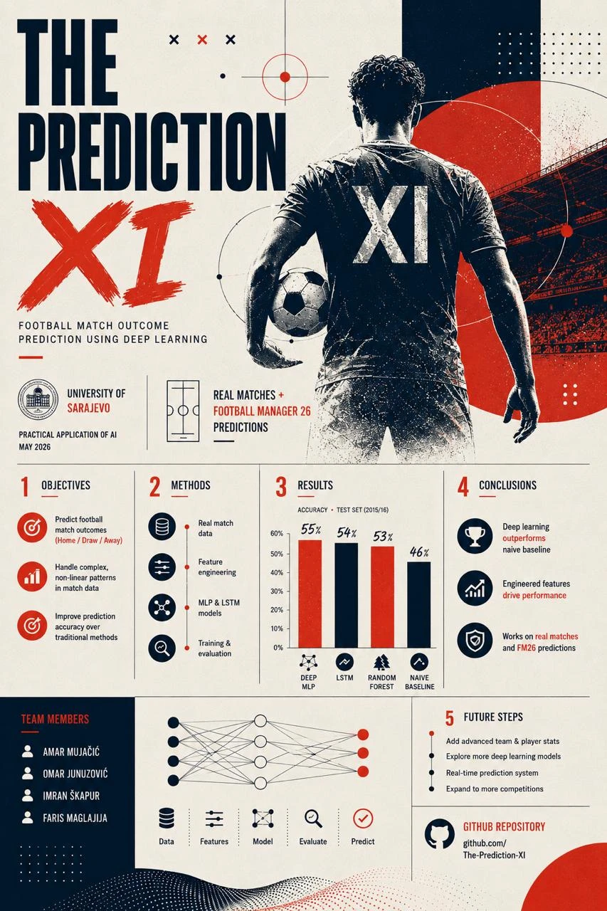
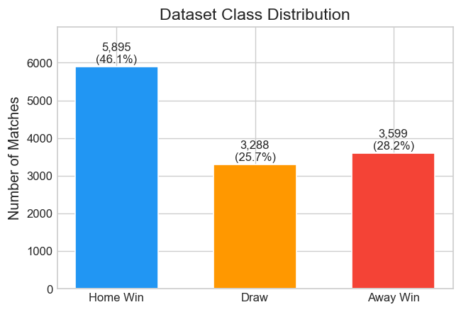
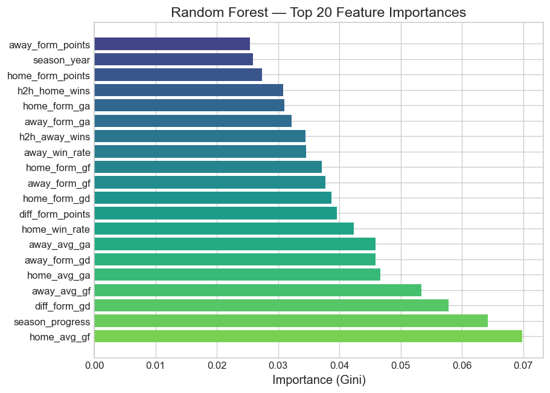
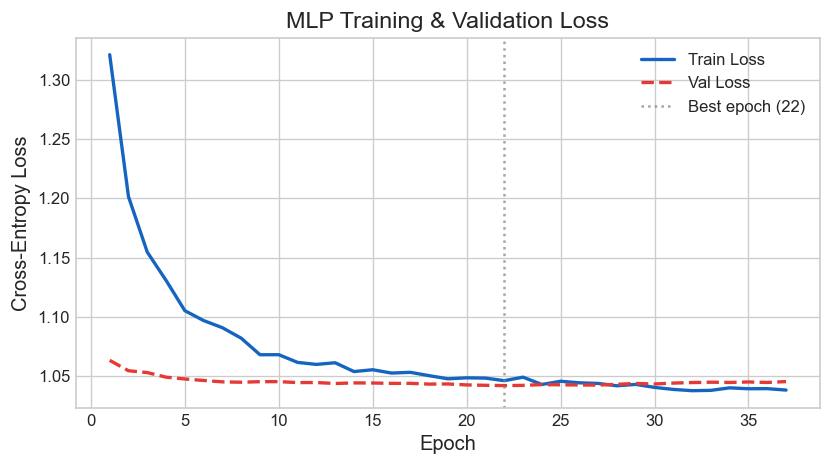
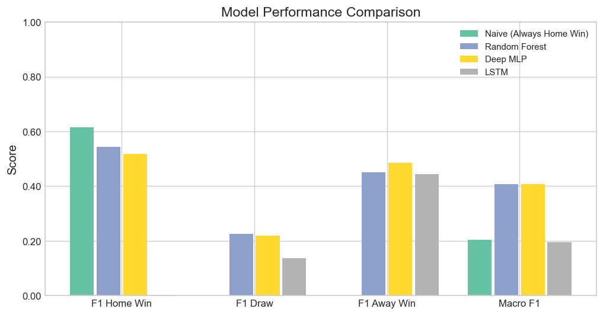
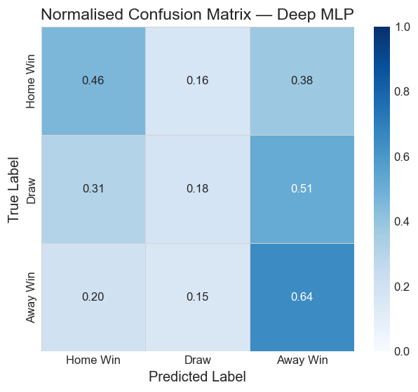

<div align="center">

# ⚽ The Prediction XI

### Football Match Outcome Prediction Using Deep Learning

*Practical Application of AI (PAAI) — University of Sarajevo*


</div>

---

<div align="center">



</div>

---

## 📌 Overview

**The Prediction XI** is a complete, end-to-end machine learning system that predicts the outcome of a football match — **Home Win**, **Draw**, or **Away Win** — from pre-match statistics.

It combines rigorous data engineering, **six** different models (from classic baselines to gradient boosting, deep neural networks, and a transformer), and a polished **interactive web app** that explains *why* it makes each prediction — and even predicts matches from your own **Football Manager 26** save game.

> 🎯 **Goal:** Turn raw historical match data into calibrated, explainable probability forecasts for any fixture.

---

## ✨ Key Features

| | Feature | Description |
|---|---|---|
| 🧠 | **6 Models** | Random Forest · XGBoost · LightGBM · Deep MLP · TabPFN · weighted Ensemble |
| 📊 | **Elo Ratings** | Live team-strength ratings updated after every match, shown before each prediction |
| 🔍 | **SHAP Explainability** | Per-prediction breakdown of which features drove the result |
| 💰 | **Bet365 Odds Comparison** | Model probabilities vs bookmaker market — highlights value gaps |
| 🎮 | **Football Manager 26** | Import your FM save's league table and predict from it |
| 📁 | **Prediction Log** | Every prediction auto-saved with accuracy tracking & CSV export |
| ⚙️ | **Optuna Tuning** | Automated hyperparameter search for the neural network |
| 📓 | **EDA Notebook** | Full exploratory analysis of leagues, odds, and trends |

---

## 🗂️ Dataset

**Source:** [football-data.co.uk](https://www.football-data.co.uk) — downloaded **automatically**, no account or API key required.

| Property | Value |
|---|---|
| 🌍 Leagues | Premier League · La Liga · Bundesliga · Serie A · Ligue 1 |
| 📅 Seasons | 2009/10 → 2015/16 (7 seasons) |
| ⚽ Matches | ~12,000 after cleaning |
| 🧪 Test split | 2015/16 season only (strict time-based split — no leakage) |

<div align="center">



*Outcome distribution — note the natural class imbalance: draws are the minority class (~26%).*

</div>

---

## 🛠️ Feature Engineering

All **35 features** are computed using **only data available before kick-off** — no future information leaks into the past.

| Group | Features |
|---|---|
| 📈 **Rolling form** (last 5) | Win/draw/loss rate, goals scored & conceded, normalised points |
| 🤝 **Head-to-head** (last 5) | Home win %, draw %, away win % |
| 🏟️ **Venue strength** (last 10) | Avg goals scored/conceded at home vs away, win rate |
| ⚖️ **Differentials** | Home minus away: form points, goal difference, win rate |
| 📊 **Elo ratings** | Continuously updated team strength score |
| 🗓️ **Season context** | Normalised matchday, league encoding |

<div align="center">



*Top features by Random Forest importance — form goal-difference and Elo-based strength dominate.*

</div>

---

## 🤖 Models

Six models are trained and compared, then combined into a soft-voting **Ensemble** weighted by validation accuracy.

```
          Data ──▶ Features ──▶ Elo ──▶ ┌─ Random Forest ─┐
                                        ├─ XGBoost ───────┤
                                        ├─ LightGBM ──────┤──▶ Ensemble ──▶ P(H) P(D) P(A)
                                        ├─ Deep MLP ──────┤
                                        └─ TabPFN ────────┘
```

**Deep MLP architecture:** `Input(35) → 256 → 128 → 64 → 3`, with BatchNorm, Dropout (0.3), ReLU, class-weighted CrossEntropy loss, Adam + ReduceLROnPlateau, and early stopping.

<div align="center">



*MLP training vs validation loss — early stopping prevents overfitting.*

</div>

---

## 📈 Results

Evaluated on the **2015/16 hold-out season** (unseen during training):

| Model | Accuracy | Macro F1 | Draw F1 | Notes |
|---|:---:|:---:|:---:|---|
| Naive (Always Home Win) | 44.4% | 0.20 | 0.00 | Trivial baseline |
| Random Forest | 43.9% | 0.41 | 0.23 | Strong interpretable baseline |
| **TabPFN** | **48.5%** | 0.34 | 0.00 | 🏆 Highest accuracy |
| XGBoost | 43.1% | 0.40 | 0.24 | Gradient boosting |
| **LightGBM** | 43.3% | **0.41** | **0.26** | 🏆 Best balanced (Macro F1) |
| Deep MLP | 42.1% | 0.38 | 0.17 | Neural network |
| Ensemble | 44.5% | 0.40 | 0.19 | Soft-voting blend |

> 📋 Exact numbers are reproduced in [`outputs/reports/comparison_table.csv`](outputs/reports/comparison_table.csv) and [`metrics_report.json`](outputs/reports/metrics_report.json) every time you run `evaluate.py`.

<div align="center">



</div>

### 🔬 Key Insight — Draws Are Genuinely Hard

Every model struggles with **draws** (best Draw F1 ≈ 0.26). This is not a bug — it's a fundamental property of football: draws have the weakest statistical signal and are the hardest outcome even for professional bookmakers. Models that maximise raw accuracy (like TabPFN) do so by essentially *never* predicting a draw, while tree-based models with class weighting recover some draw recall at a small accuracy cost.

<div align="center">



*Normalised confusion matrix (Deep MLP) — draws are frequently misclassified as wins.*

</div>

---

## 🖥️ Interactive Web App

Launch with `streamlit run app.py`. Three tabs:

### 1️⃣ Historical Data
- Pick any two teams from 5 European leagues
- **Live Elo ratings** with tier badges (Elite / Strong / Average / Weak / Poor)
- Predict with any of the 6 models
- **SHAP chart** — *"Why this prediction?"*
- **Bet365 odds comparison** — model vs market

### 2️⃣ Football Manager
- Import your **FM26** league-table export (CSV or HTML)
- Predicts outcomes from your save game's stats
- A working sample is included: [`data/fm_exports/fm_table.csv`](data/fm_exports/fm_table.csv)

### 3️⃣ Prediction Log
- Every prediction auto-saved
- Enter actual results to track live accuracy
- Pie chart, confidence breakdown, and CSV download

---

## 🚀 How to Run

### First-time setup

```bash
# 1. Clone
git clone https://github.com/AmarMujacic/The-Prediction-XI.git
cd The-Prediction-XI

# 2. Install dependencies
pip install -r requirements.txt

# 3. Build data (auto-downloads from football-data.co.uk)
python src/preprocessing.py
python src/features.py
python src/elo.py

# 4. Train all models (~5 min)
python src/train.py --skip-optuna

# 5. Evaluate + generate plots
python src/evaluate.py
python src/visualize.py

# 6. Launch the app
streamlit run app.py
```

### Subsequent runs

```bash
streamlit run app.py
```

### Optional flags

```bash
python src/train.py            # full Optuna hyperparameter search (~25 min)
python src/train.py --lstm     # also train the LSTM sequence model
```

> 💡 If TabPFN/Ensemble errors on CPU, run once: `set TABPFN_ALLOW_CPU_LARGE_DATASET=1`

---

## 🎮 Using Football Manager Data

The app predicts from your FM save's league-table statistics.

**Recommended — CSV** (works on every FM version). Create a file in `data/fm_exports/`:

```csv
team,played,wins,draws,losses,goals_scored,goals_conceded,points
Man City,20,14,3,3,49,19,45
Liverpool,20,13,3,4,48,23,42
...
```

A complete FM26 example is included at [`data/fm_exports/fm_table.csv`](data/fm_exports/fm_table.csv).
Then open the app → **Football Manager** tab → reload or upload the file.

> ℹ️ In FM26, `Ctrl+P` opens *Preferences* — use the export icon on a league-table view for HTML, or just use the CSV method above.

---

## 📁 Project Structure

```
The-Prediction-XI/
├── data/
│   ├── raw/                    ← auto-downloaded CSVs (gitignored)
│   ├── processed/              ← cleaned parquet files (gitignored)
│   └── fm_exports/             ← Football Manager exports (+ sample)
├── notebooks/
│   └── exploration.ipynb       ← EDA notebook
├── src/
│   ├── preprocessing.py        ← download, clean, encode
│   ├── features.py             ← 35 engineered features
│   ├── elo.py                  ← Elo rating system
│   ├── model.py                ← all 6 model definitions + Ensemble
│   ├── train.py                ← training pipeline + Optuna
│   ├── evaluate.py             ← metrics, confusion matrices, calibration
│   ├── visualize.py            ← all plots
│   ├── shap_explain.py         ← SHAP explainability
│   └── fm_import.py            ← Football Manager importer
├── outputs/
│   ├── models/                 ← trained weights (gitignored)
│   ├── plots/                  ← generated figures
│   └── reports/                ← metrics & comparison tables
├── poster/
│   └── poster.webp             ← final project poster
├── app.py                      ← Streamlit web app
├── CONTRIBUTORS.md
├── PHASE8_CONCLUSIONS.md       ← conclusions & future work
├── requirements.txt
└── README.md
```

---

## 🔁 Reproducibility

- 🎲 Fixed random seed `42` (NumPy + PyTorch)
- ⏱️ Strict time-based split — test set is always 2015/16
- 💾 Normalisation stats saved to `outputs/models/norm_stats.pkl`
- 📦 All artefacts regenerated deterministically by the pipeline

---

## 🧭 Conclusions & Future Work

**What we learned:**
- Football outcomes carry **irreducible randomness** — models cluster near the home-win baseline, which is itself a meaningful, honest result.
- **Feature engineering matters more than model choice** — a well-fed Random Forest rivals a tuned neural net.
- **Class weighting is essential** — without it, models ignore draws entirely.
- **Calibration** of the MLP makes its probabilities trustworthy for downstream use.

**Next steps:**
- 👥 Player-level features (injuries, lineups, suspensions)
- 📡 Real-time API pipeline for upcoming fixtures
- 🧬 Transformer over full-season match sequences
- 🎮 Deeper Football Manager integration

📄 Full discussion in [`PHASE8_CONCLUSIONS.md`](PHASE8_CONCLUSIONS.md).

---

## 👥 Contributors

| | Name | GitHub |
|---|---|---|
| 🧑‍💻 | **Amar Mujačić** | [@AmarMujacic](https://github.com/AmarMujacic) |
| 🧑‍💻 | **Omar Junuzović** | [@OmarJunuzovic](https://github.com/OmarJunuzovic) |
| 🧑‍💻 | **Imran Škapur** | [@iskapur1-sketch](https://github.com/iskapur1-sketch) |
| 🧑‍💻 | **Faris Maglajlija** | [@MaglajlijaF](https://github.com/MaglajlijaF) |

<div align="center">

*Practical Application of AI · University of Sarajevo · 2026*

</div>
